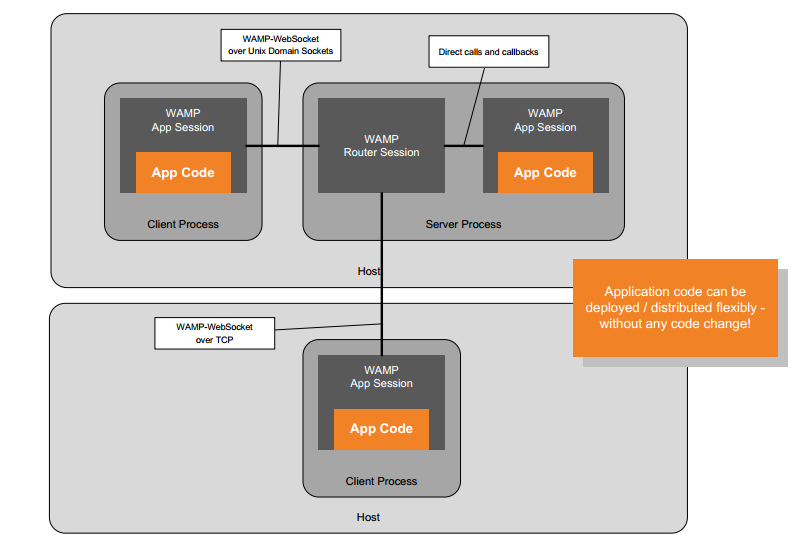
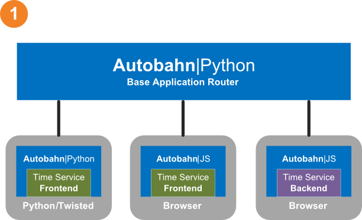
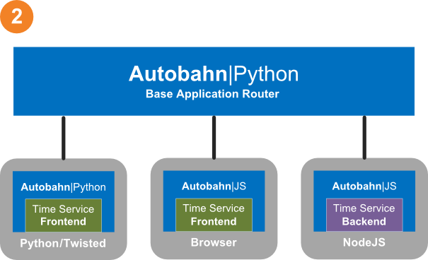
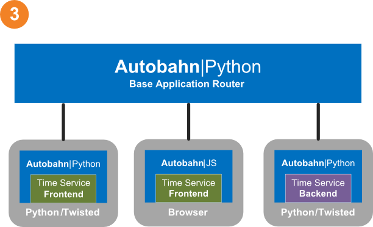
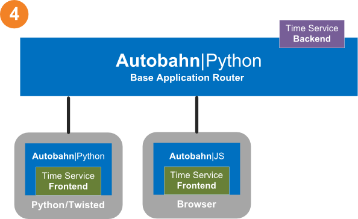

# WAMP v2 Examples

The examples in this folder serve to illustrate **[WAMP version 2](https://github.com/tavendo/WAMP/blob/master/spec/README.md)** on [**Autobahn**|Python](http://autobahn.ws/):

* WAMP **RPC** and **PubSub** features for application use
* example WAMP **application components** and **routers**

# Application Component Deployment

**[WAMP v2](https://github.com/tavendo/WAMP/blob/master/spec/README.md)** on [**Autobahn**|Python](http://autobahn.ws/) allows to run application components in different deployment configurations without any changes to application code:



## Running the Demos

All demos use the same two example application routers to host the application components for a demo:

 * [A WAMP/WebSocket server container](server.py)
 * [A WAMP/WebSocket client container](client.py)

The application components of the demos are separate from the example application routres, and each application component demonstrates a different RPC or PubSub feature.

### Router with embedded application backend component

Run the example application router on a WebSocket transport server and start a demo "backend" application component inside the router:

	python server.py --component "rpc.timeservice.backend.Component"

Run the demo "frontend" application component over a WebSocket transport client:

	python client.py --component "rpc.timeservice.frontend.Component"


### Application backend component in client

Run the example application router on a WebSocket transport server:

	python server.py

Run the demo "backend" application component over a WebSocket transport client:

	python client.py --component "rpc.timeservice.backend.Component"

Run the demo "frontend" application component over a WebSocket transport client:

	python client.py --component "rpc.timeservice.frontend.Component"


### Other Transports

To start a server accepting WAMP connections on TCP port 8080 using a **rawsocket** transport with MsgPack serialization:

```shell
python server.py --debug --endpoint "tcp:8080" --transport "rawsocket-msgpack" --compont "rpc.timeservice.backend.Component"
```

To start a client connecting to this server:

```shell
python client.py --endpoint "tcp:127.0.0.1:8080" --transport "rawsocket-msgpack" --component "rpc.timeservice.frontend.Component"
```


## Available Demos

### Remote Procedure Calls

#### Time Service

A trivial time service - demonstrates basic remote procedure feature.

 * `rpc.timeservice.backend.Component`
 * `rpc.timeservice.frontend.Component`

#### Slow Square

Demonstrates procedures which return promises and return asynchronously.

 * `rpc.slowsquare.backend.Component`
 * `rpc.slowsquare.frontend.Component`

#### Arguments

Demonstrates all variants of call arguments.

 * `rpc.arguments.backend.Component`
 * `rpc.arguments.frontend.Component`

#### Complex Result

Demonstrates complex call results (call results with more than one positional or keyword results).

 * `rpc.complex.backend.Component`
 * `rpc.complex.frontend.Component` 

#### Errors

Demonstrates error raising and catching over remote procedures.

 * `rpc.errors.backend.Component`
 * `rpc.errors.frontend.Component` 

#### Progressive Results

Demonstrates calling remote procedures that produce progressive results.

 * `rpc.progress.backend.Component`
 * `rpc.progress.frontend.Component` 

#### Options

Using options with RPC.

 * `rpc.options.backend.Component`
 * `rpc.options.backend.Component` 


### Publish & Subscribe

#### Time Service

Demonstrates basic publish and subscribe.

 * `pubsub.basic.backend.Component`
 * `pubsub.basic.frontend.Component`

#### Complex Events

Demonstrates publish and subscribe with complex events.

 * `pubsub.complex.backend.Component`
 * `pubsub.complex.frontend.Component`

#### Options

Using options with PubSub.

 * `pubsub.options.backend.Component`
 * `pubsub.options.frontend.Component`

#### Unsubscribing

Shows how to unsubscribe.

 * `pubsub.unsubscribe.backend.Component`
 * `pubsub.unsubscribe.frontend.Component`


### Session

#### Session Series

Demonstrates how multiple sessions can exist during the lifetime of the underlying transport.

 * `session.series.backend.Component`
 * `session.series.frontend.Component`


## AutobahnJS-based Demos

In addition, the demo front- and backends are available as AutobahnJS-based versions to run in browsers and NodeJS.

For example, run the example application router on a WebSocket transport server and start a demo "backend" application component inside the router:

	python server.py --component "rpc.timeservice.backend.Component"

Then, open the JavaScript frontend in a browser:

    rpc/timeservice_frontend.html

To run the frontend from NodeJS, install AutobahnJS

	npm install autobahn
	npm install when

and then

	node rpc/timeservice_frontend.js

To run the backend in NodeJS, run the plain router

	python server.py

and then start the backend:

	node rpc/timeservice_backend.js

### Deployment Options

Application frontend in browser, application backend in browser:



Application frontend in browser, application backend in NodeJS:



Application frontend in browser, application backend in Python:



Application frontend in browser, application backend in Python (Router embedded):


